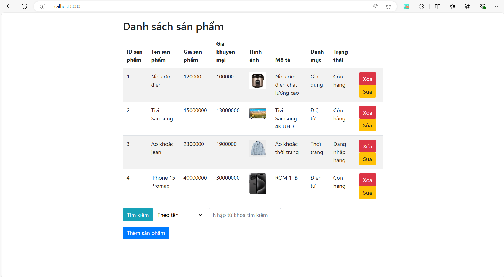

# Java Spring Boot + SQL Server 

__Họ và tên: Lê Anh Minh__  
__Lớp: 22IT2__  
__Mã SV: BIT220106__  

## Cách chạy: 
Run application rồi mở trình duyệt lên và vào trang http://localhost:8080/ 

## Giao diện:

## Code tạo csdl
CREATE DATABASE SANPHAM  
USE SANPHAM  
GO  

CREATE TABLE SanPham (  
    [Id] INT NOT NULL PRIMARY KEY,  
    [Ten] NVARCHAR(255) NULL,  
    [GiaSanPham] DECIMAL(18, 2) NULL,  
    [GiaKhuyenMai] DECIMAL(18, 2) NULL,  
    [HinhAnh] NVARCHAR(255) NULL,  
    [MoTa] NVARCHAR(400) NULL,  
    [DanhMuc] NVARCHAR(50) NULL CHECK ([DanhMuc] IN (N'Điện tử', N'Thời trang', N'Gia dụng')),  
    [TrangThai] NVARCHAR(100) NULL  
);  

INSERT INTO [dbo].[SanPham] (Id, Ten, GiaSanPham, GiaKhuyenMai, HinhAnh, MoTa, DanhMuc, TrangThai)  
VALUES  
(1, N'Nồi cơm điện', 120000, 100000, 'https://cdn.glitch.global/a74304d6-94d2-40a3-aa80-2157223db768/noiCom.jpg?v=1723662258859', N'Nồi cơm điện chất lượng cao', N'Gia dụng', N'Còn hàng'),  
(2, N'Tivi Samsung', 15000000, 13000000, 'https://cdn.glitch.global/a74304d6-94d2-40a3-aa80-2157223db768/tivi.jpg?v=1723662368947', N'Tivi Samsung 4K UHD', N'Điện tử', N'Còn hàng'),  
(3, N'Áo khoác jean', 2300000, 1900000, 'https://cdn.glitch.global/a74304d6-94d2-40a3-aa80-2157223db768/ao%20khoac.jpg?v=1723662361756', N'Áo khoác thời trang', N'Thời trang', N'Đang nhập hàng'),  
(4, N'IPhone 15 Promax', 40000000, 30000000, 'https://cdn.glitch.global/a74304d6-94d2-40a3-aa80-2157223db768/iphone.jpg?v=1723663157193', N'ROM 1TB', N'Điện tử', N'Còn hàng');  

